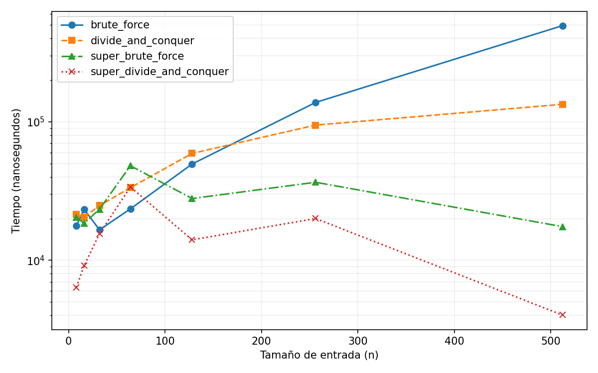

# Tarea 1: Min distances

## Descripción

Este repositorio contiene los archivos relacionados con la [tarea 1](tarea1.pdf)
del curso Análisis de Algoritmos (2025-1).

El objetivo es implementar, y comparar, algoritmos con diferentes técnicas para
encontrar la distancia euclidiana mínima entre puntos en un plano 2D:

- Fuerza bruta
- Dividir y vencer
- Ambos con mejores respecto a un plano 100 x 100



## Integrantes

- Alonso Bustos
- Gabriela Eweldt
- Constanza Cristinich

## Uso

Usar scripts bash para testear algoritmos:

```bash
# Testear todos los algoritmos con una determinada cantidad de puntos
./test_all.sh <n_points>

# Ejecutar todas las pruebas y graficar resultados
./benchmark.sh
```
